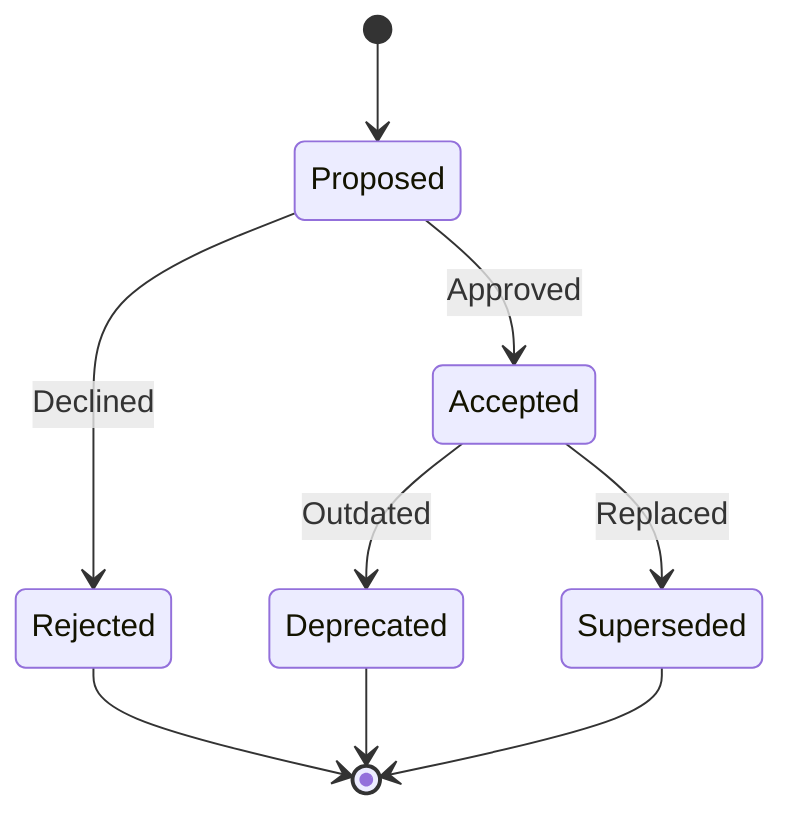

# Architecture Decision Records (ADR)

This directory contains Architecture Decision Records documenting significant architectural and design decisions made in the AI Grounding project.

## What is an ADR?

An Architecture Decision Record (ADR) is a document that captures an important architectural decision made along with its context and consequences.

## ADR Format

Each ADR follows this structure:

```markdown
# ADR-XXX: Title

**Status**: [Proposed | Accepted | Rejected | Deprecated | Superseded]
**Date**: YYYY-MM-DD
**Deciders**: Names of decision makers
**Related**: Links to related ADRs

## Context

What is the issue or problem we're facing?

## Decision

What is the change we're proposing or have made?

## Consequences

### Positive
- Benefits and advantages

### Negative
- Trade-offs and disadvantages

### Neutral
- Other impacts

## Alternatives Considered

### Option 1
Description and reason for not choosing

### Option 2
Description and reason for not choosing

## Implementation Notes

Practical guidance for implementing this decision

## References

Links to relevant resources, discussions, or documentation
```

## Index of ADRs

| ADR | Title | Status | Date |
|-----|-------|--------|------|
| [001](./adr-001-vector-store-selection.md) | Vector Store Selection (FAISS vs Chroma) | Accepted | 2025-12-31 |
| [002](./adr-002-batch-size.md) | Batch Processing Size Strategy | Accepted | 2025-12-31 |
| [003](./adr-003-compact-documents.md) | Compact Document Strategy for Embeddings | Accepted | 2025-12-31 |
| [004](./adr-004-differential-updates.md) | Differential Vectorstore Updates | Accepted | 2025-12-31 |

## ADR Lifecycle



### Status Definitions

- **Proposed**: Under discussion, not yet decided
- **Accepted**: Decision approved and implemented
- **Rejected**: Decision declined, alternative chosen
- **Deprecated**: No longer recommended, still supported
- **Superseded**: Replaced by a newer ADR (link provided)

## Creating a New ADR

1. **Copy template**: Use format above
2. **Number sequentially**: Next available number (e.g., ADR-005)
3. **Fill in sections**: Provide context, decision, and consequences
4. **Update index**: Add entry to table above
5. **Link from code**: Reference ADR in relevant code comments

## Naming Convention

Files should follow this pattern:
```
adr-XXX-short-title.md
```

Examples:
- `adr-001-vector-store-selection.md`
- `adr-002-batch-size.md`
- `adr-015-multi-modal-support.md`

## Best Practices

1. **Write when decided**: Document as decisions are made, not retroactively
2. **Be concise**: Focus on "why" over "how"
3. **Include alternatives**: Show what was considered
4. **Link extensively**: Reference related ADRs and documentation
5. **Update status**: Mark as superseded when replaced

## Related Documentation

- [Architecture](../architecture.md) - Overall system design
- [Roadmap](../roadmap.md) - Future decision areas
- [Changelog](../changelog.md) - Implementation timeline

---

*Last Updated*: December 31, 2025
