# ADR-004: Differential Vectorstore Updates

**Status**: Accepted  
**Date**: 2025-12-31  
**Deciders**: Project Architecture Team  
**Related**: [ADR-001](./adr-001-vector-store-selection.md), [ADR-003](./adr-003-compact-documents.md)

## Context

Task 3 (Input-Output Grounding) uses a persistent Chroma vectorstore for semantic search. The User Service dynamically generates/deletes users every 5 minutes, simulating real-world data changes.

### Problem

**Initial State**: 1000 users in vectorstore

**After 5 minutes**: 
- 50 users deleted
- 50 new users added
- Total still 1000, but different users

**Query Challenge**: How to keep vectorstore synchronized with live data?

### Requirements

- **Consistency**: Vectorstore should reflect current User Service state
- **Efficiency**: Avoid rebuilding entire vectorstore each time
- **Cost**: Minimize embedding token usage
- **Reliability**: Handle failures gracefully

## Decision

We will implement **differential updates** that synchronize the vectorstore on every query:

1. **Fetch current user IDs** from User Service
2. **Compare with vectorstore IDs** (set difference)
3. **Delete removed users** from vectorstore
4. **Add new users** to vectorstore
5. **Persist changes** to disk

**Update Frequency**: Before each similarity search (proactive sync)

## Consequences

### Positive

- ✅ **Always Consistent**: Vectorstore matches live data
- ✅ **Cost-Efficient**: Only embed new users (50 vs 1000)
  - Embedding cost: ~$0.0005 vs ~$0.01 per sync
  - 95% cost reduction compared to full rebuild

- ✅ **Fast Updates**: 1-3 seconds vs 10-15 seconds for full rebuild
  
- ✅ **Disk Persistence**: Changes saved automatically by Chroma

- ✅ **Graceful Scaling**: Works for 10 new users or 100 new users

- ✅ **Simple Logic**: Set operations easy to understand and maintain

### Negative

- ❌ **Query Overhead**: Every query triggers sync check
  - Adds 1-3 seconds to first search per query
  - Acceptable for demo but could accumulate at scale

- ❌ **Potential Race Conditions**: 
  - User deleted between fetch and search
  - Mitigated by output grounding (ID verification)

- ❌ **Network Dependency**: Requires User Service availability
  - Vectorstore becomes outdated if service unreachable
  - Could add caching/staleness tolerance

### Neutral

- 🔹 **Proactive vs Lazy**: Updates before search, not in background
- 🔹 **No TTL Logic**: Doesn't track when last synced

## Alternatives Considered

### Alternative 1: Full Rebuild on Each Query

**Approach**:
```python
# Fetch all users
users = user_client.get_all_users()

# Rebuild vectorstore from scratch
documents = [format_user_document(u) for u in users]
vectorstore = Chroma.from_documents(documents, embeddings)
```

**Pros**:
- Simplest implementation
- Always perfectly consistent
- No comparison logic needed

**Cons**:
- Extremely expensive: 10,000 tokens per query
- Slow: 10-15 seconds per query
- Wasteful: Re-embeds unchanged users (95% redundant)

**Cost Analysis** (100 queries per day):
- Tokens: 1,000,000 per day
- Cost: ~$1.00 per day
- Differential: ~$0.05 per day (95% savings)

**Reason for Rejection**: Prohibitively expensive for production use.

---

### Alternative 2: No Updates (Static Vectorstore)

**Approach**: Build once, never update.

**Pros**:
- Zero update overhead
- Fastest queries
- Simplest code

**Cons**:
- Becomes stale immediately
- Missing new users (false negatives)
- Returns deleted users (false positives)
- Unrealistic for educational value

**Reason for Rejection**: Doesn't demonstrate real-world data synchronization patterns.

---

### Alternative 3: Background Sync (Periodic Updates)

**Approach**: Update vectorstore every N minutes in background thread.

```python
import threading

def background_sync():
    while True:
        time.sleep(300)  # 5 minutes
        sync_vectorstore()

thread = threading.Thread(target=background_sync, daemon=True)
thread.start()
```

**Pros**:
- No query overhead
- Predictable sync intervals
- Good for production

**Cons**:
- Complex lifecycle management
- Potential inconsistency window (up to 5 min)
- Thread safety concerns
- Harder to demonstrate/debug

**Reason for Rejection**: Over-engineering for educational project. Could be future enhancement.

---

### Alternative 4: Event-Driven Updates (Webhooks)

**Approach**: User Service sends events on changes, vectorstore updates reactively.

**Pros**:
- Real-time consistency
- Zero polling overhead
- Scalable architecture

**Cons**:
- Requires User Service modification
- Complex event handling
- Not supported by mock service
- Overkill for demo

**Reason for Rejection**: Beyond scope of educational demo.

---

### Alternative 5: Timestamp-Based Sync

**Approach**: Track last sync time, only fetch users changed since then.

```python
last_sync = vectorstore.get_metadata('last_sync_time')
new_users = user_client.get_users_since(last_sync)
```

**Pros**:
- Efficient (only fetch changed users)
- No full user list needed

**Cons**:
- Requires User Service API support (`/users/since`)
- Mock service doesn't provide timestamps
- Complex deleted user detection

**Reason for Rejection**: Requires API changes not available in mock service.

## Implementation Notes

### Update Algorithm

```python
async def _update_vectorstore_with_diffs(self):
    # 1. Fetch current users
    users = await asyncio.to_thread(user_client.get_all_users)
    current_ids = {str(u.get("id")) for u in users}
    
    # 2. Get vectorstore IDs
    vs_ids = set(self.vectorstore._collection.get()['ids'])
    
    # 3. Compute differences
    to_delete = vs_ids - current_ids  # IDs in VS but not in API
    to_add = current_ids - vs_ids      # IDs in API but not in VS
    
    # 4. Delete removed users
    if to_delete:
        self.vectorstore.delete(ids=list(to_delete))
    
    # 5. Add new users
    if to_add:
        new_users = [u for u in users if str(u.get("id")) in to_add]
        documents = [
            Document(
                page_content=format_user_document(u),
                metadata={"user_id": u.get("id")}
            )
            for u in new_users
        ]
        self.vectorstore.add_documents(documents)
    
    # 6. Persist (if supported)
    try:
        self.vectorstore.persist()
    except AttributeError:
        pass  # Some versions auto-persist
```

### Integration into Query Flow

```python
async def retrieve_context(self, query: str, k: int = 50):
    # Sync before search
    await self._update_vectorstore_with_diffs()
    
    # Perform search on updated store
    results = self.vectorstore.similarity_search(query, k=k)
    return results
```

### Error Handling

```python
async def _update_vectorstore_with_diffs(self):
    try:
        users = await asyncio.to_thread(user_client.get_all_users)
    except Exception as e:
        print(f"⚠️  User Service unavailable: {e}")
        print("   Using potentially stale vectorstore")
        return  # Continue with existing data
    
    # ... rest of update logic
```

## Performance Analysis

### Update Scenarios

| Scenario | Users Changed | Operation | Time | Token Cost |
|----------|---------------|-----------|------|------------|
| No changes | 0 | None | 0.5s | 0 |
| Few changes | 10 | Add 10 | 1.5s | ~100 |
| Typical | 50 | Add 50, Delete 50 | 2.5s | ~500 |
| Many changes | 200 | Add 200, Delete 200 | 5s | ~2000 |
| Full turnover | 1000 | Add 1000, Delete 1000 | 15s | ~10,000 |

**Typical Case** (50 changes per 5 min):
- Update frequency: Every query (varies)
- Cost per update: ~$0.0005
- Time per update: 2.5 seconds

**Comparison to Full Rebuild**:
- Full rebuild: 15s, $0.01
- Differential: 2.5s, $0.0005
- Savings: 83% time, 95% cost

### Latency Breakdown

```mermaid
gantt
    title Differential Update Latency
    dateFormat  ss
    axisFormat %Ss
    
    section Differential Update
    Fetch Users       :a1, 00, 01s
    Compute Diff      :a2, after a1, 00s
    Delete Old        :a3, after a2, 00s
    Embed New (50)    :a4, after a3, 01s
    Add to VS         :a5, after a4, 00s
    Persist           :a6, after a5, 00s
    Total             :milestone, after a6, 0s
    
    section Full Rebuild
    Fetch Users       :b1, 00, 01s
    Embed All (1000)  :b2, after b1, 12s
    Build VS          :b3, after b2, 02s
    Total             :milestone, after b3, 0s
```



## Cost-Benefit Analysis

### 100 Queries/Day Scenario

**Differential Updates**:
```
Updates: 100 (one per query)
Avg changes: 50 users
Tokens: 50,000 (100 updates × 500 tokens)
Cost: ~$0.05/day
Time: 250 seconds total (2.5s each)
```

**Full Rebuilds**:
```
Rebuilds: 100
All users: 1000
Tokens: 1,000,000 (100 rebuilds × 10k tokens)
Cost: ~$1.00/day
Time: 1500 seconds total (15s each)
```

**Savings**:
- Cost: 95% ($0.95/day)
- Time: 83% (1250 seconds/day)
- Monthly: ~$28.50 saved

## Consistency Guarantees

### What We Guarantee

- ✅ Vectorstore reflects User Service state at query time
- ✅ Deleted users removed before search
- ✅ New users available for search
- ✅ Changes persisted across sessions

### What We Don't Guarantee

- ❌ Real-time consistency (updates only on query)
- ❌ Atomicity across vectorstore and User Service
- ❌ Consistency during concurrent queries
- ❌ Recovery from partial failures

### Race Condition Example

```
Timeline:
T0: Query starts, fetches users [1, 2, 3, 4]
T1: User Service deletes user 3
T2: Vectorstore synced (user 3 removed)
T3: LLM extracts user_id 3 from old embeddings (still in search results)
T4: Output grounding fetches user 3 → 404 Not Found
T5: User 3 filtered out (graceful handling)
```

**Mitigation**: Output grounding step verifies all IDs.

## Future Enhancements

### Version 1.1: Cache Sync Status

```python
class SmartVectorstore:
    def __init__(self):
        self.last_sync = None
        self.sync_interval = 60  # seconds
    
    async def maybe_sync(self):
        if not self.last_sync or time.time() - self.last_sync > self.sync_interval:
            await self._update_vectorstore_with_diffs()
            self.last_sync = time.time()
```

### Version 1.2: Background Sync Thread

```python
class AsyncVectorstore:
    def __init__(self):
        self.start_background_sync(interval=300)
    
    def start_background_sync(self, interval):
        asyncio.create_task(self._sync_loop(interval))
    
    async def _sync_loop(self, interval):
        while True:
            await asyncio.sleep(interval)
            await self._update_vectorstore_with_diffs()
```

### Version 2.0: Change Data Capture

Integrate with CDC tools (Debezium, etc.) for event-driven updates.

## References

- [Chroma Collection API](https://docs.trychroma.com/reference/Collection)
- [Set Operations in Python](https://docs.python.org/3/library/stdtypes.html#set)
- [Change Data Capture Patterns](https://en.wikipedia.org/wiki/Change_data_capture)

## Related Decisions

- [ADR-001: Vector Store Selection](./adr-001-vector-store-selection.md) - Why Chroma for persistence
- [ADR-003: Compact Documents](./adr-003-compact-documents.md) - Impacts update cost

---

**Status History**:
- 2025-12-31: Proposed and Accepted
