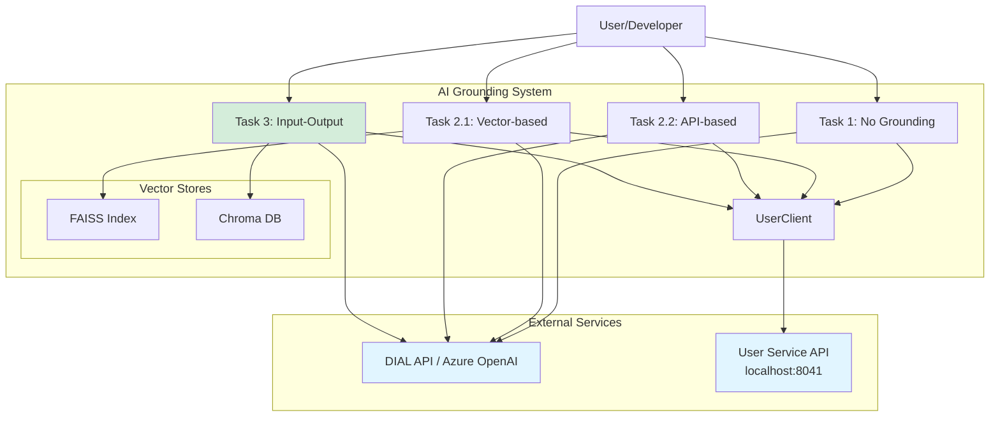
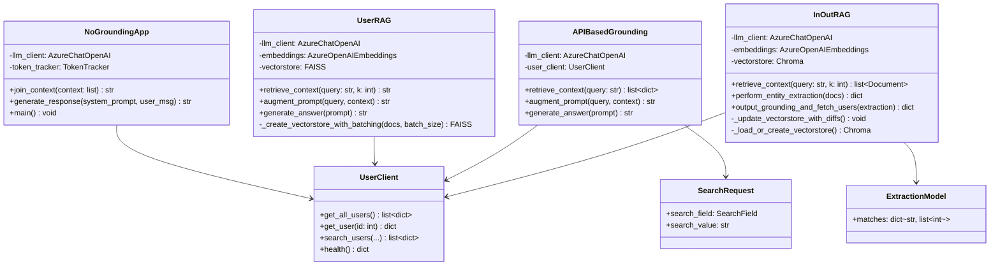
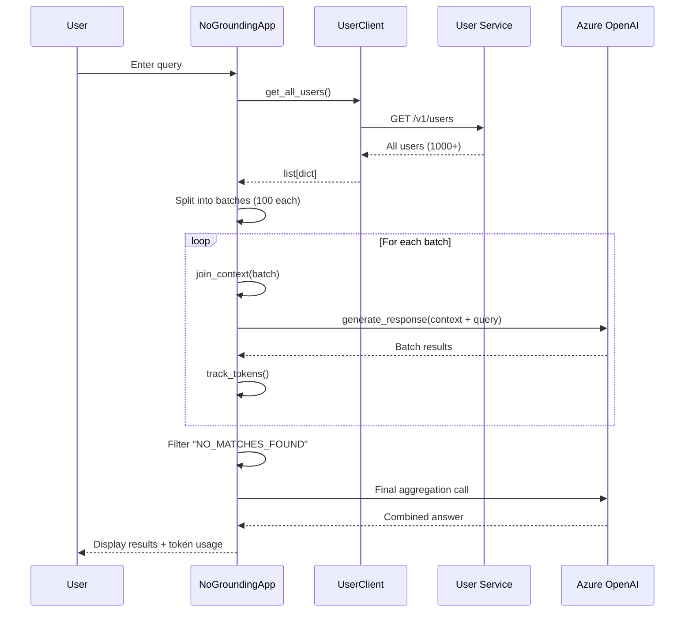
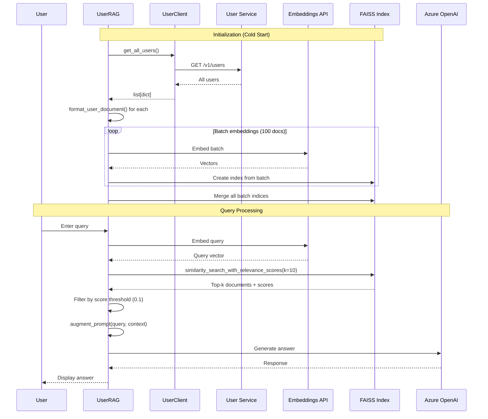
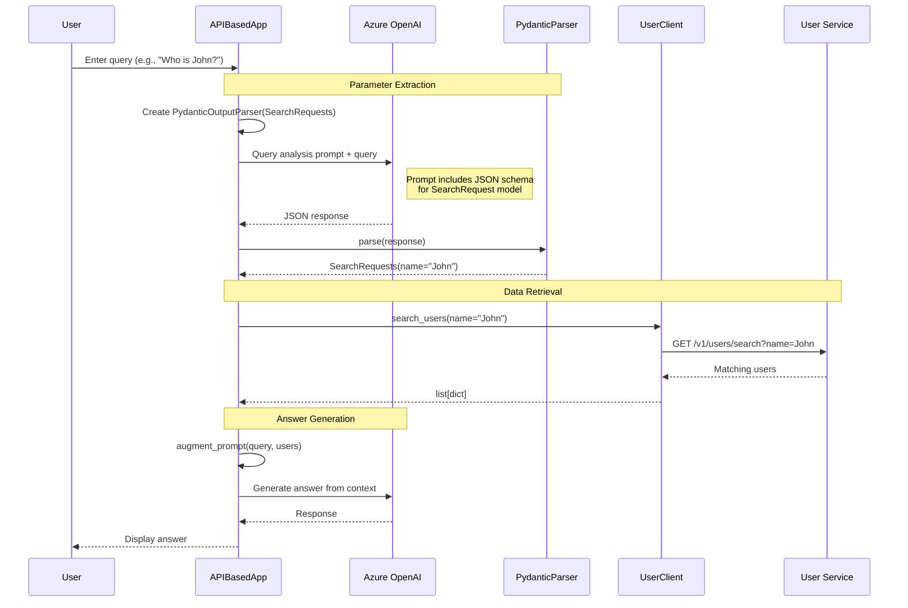
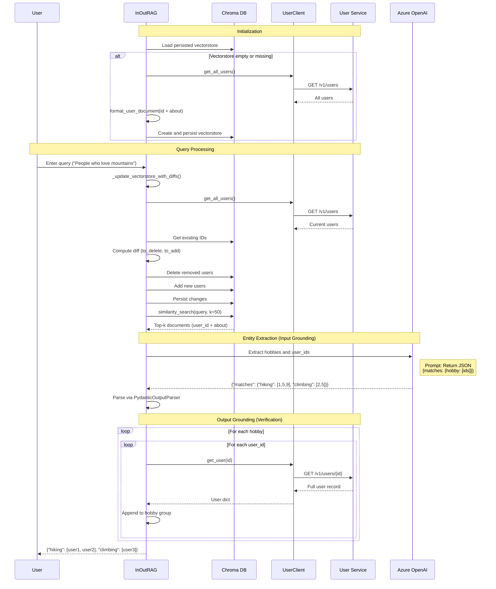
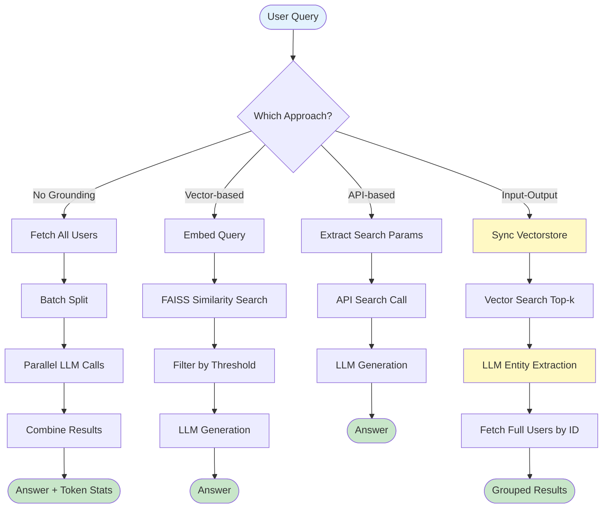

# System Architecture

## Table of Contents

- [Overview](#overview)
- [System Context](#system-context)
- [Component Architecture](#component-architecture)
- [Grounding Strategy Architectures](#grounding-strategy-architectures)
- [Data Flow](#data-flow)
- [Technology Stack](#technology-stack)
- [Design Decisions](#design-decisions)
- [Integration Points](#integration-points)
- [Performance Considerations](#performance-considerations)

## Overview

The AI Grounding project implements a modular architecture demonstrating three distinct approaches to connecting LLMs with external data sources. The system is designed for educational purposes, emphasizing clarity, maintainability, and demonstrating production-ready patterns.

### Architecture Principles

1. **Separation of Concerns**: Each grounding strategy is isolated in its own module
2. **Async-First**: All I/O operations use asyncio for efficient resource utilization
3. **Type Safety**: Pydantic models enforce data contracts and validation
4. **Explicit Dependencies**: Clear dependency injection for testability
5. **Cost Awareness**: Token tracking and optimization strategies

## System Context



### System Boundaries

- **In Scope**: RAG implementation patterns, vector search, structured output extraction
- **Out of Scope**: Production deployment, authentication/authorization, multi-tenancy
- **External Dependencies**: Azure OpenAI (via DIAL), Docker-based user service

## Component Architecture

### Core Components



### Module Structure

```
task/
├── __init__.py                 # Package marker
├── _constants.py               # Configuration (API endpoints, keys)
├── user_client.py              # User service API client
├── t1/                         # No Grounding implementation
│   ├── __init__.py
│   └── no_grounding.py         # Main script
├── t2/                         # Input-based Grounding
│   ├── __init__.py
│   ├── Input_vector_based.py  # FAISS vector search
│   └── input_api_based.py     # API parameter extraction
└── t3/                         # Input-Output Grounding
    ├── __init__.py
    ├── in_out_grounding.py     # Main implementation
    └── run_local_test.py       # Test harness
```

## Grounding Strategy Architectures

### 1. No Grounding Architecture

**Philosophy**: Baseline approach using direct context injection without filtering or retrieval.



**Key Characteristics**:
- **Batch Size**: 100 users per LLM call
- **Parallelization**: `asyncio.gather()` for batch processing
- **Token Tracking**: Records usage per batch and total
- **Result Filtering**: Removes empty batches before final aggregation

**Trade-offs**:
- ✅ Simple implementation
- ✅ Complete data coverage
- ❌ High token costs (~10-50k tokens per query)
- ❌ Context window constraints with large datasets
- ❌ Risk of information loss through LLM processing

### 2. Input-based Grounding Architecture

#### 2.1 Vector-based Architecture

**Philosophy**: Use semantic similarity to filter relevant users before LLM processing.



**Key Components**:
- **Document Format**: `user_id + \n + about_field` (minimal for embeddings)
- **Embedding Model**: `text-embedding-3-small-1` (384 dimensions)
- **Batch Size**: 100 documents per embedding call
- **Search Parameters**: k=10, score_threshold=0.1
- **Persistence**: In-memory FAISS index (recreated per session)

**Optimization Strategies**:
1. **Parallel Batch Processing**: Embed multiple batches concurrently
2. **Compact Documents**: Only embed relevant fields to reduce token costs
3. **Index Merging**: Combine batch indices into single searchable structure

#### 2.2 API-based Architecture

**Philosophy**: Extract structured search parameters and use API queries for exact matches.



**Key Components**:
- **Pydantic Models**: `SearchRequest`, `SearchRequests` for structured extraction
- **Query Analysis Prompt**: Instructs LLM to extract name/surname/email
- **Search Fields**: Enum-based field validation
- **Fallback**: Returns empty list if no parameters extracted

**Advantages**:
- Exact field matching against live data
- Lower token costs (no embeddings)
- Straightforward parameter extraction

**Limitations**:
- Requires explicit field mentions ("John" works, "someone interested in hiking" doesn't)
- Limited to API-supported search fields
- Additional LLM call for parameter extraction

### 3. Input-Output Grounding Architecture

**Philosophy**: Combine vector search for candidate selection with structured output extraction and real-time verification.



**Key Innovations**:

1. **Compact Embedding Strategy**
   - Only embed `user_id` + `about` field
   - Reduces embedding costs by ~80%
   - Minimizes PII exposure in vector store

2. **Differential Vectorstore Updates**
   ```python
   current_ids = {user.id for user in get_all_users()}
   stored_ids = vectorstore.get_all_ids()
   to_delete = stored_ids - current_ids
   to_add = current_ids - stored_ids
   ```
   - Syncs vectorstore with live data on each query
   - Avoids full rebuild (cost-efficient)

3. **Named Entity Extraction (NEE)**
   - LLM extracts structured hobby→user_id mappings
   - Reduces generation tokens (IDs vs full records)
   - Prevents hallucination of user details

4. **Output Grounding**
   - Verifies each extracted user_id against API
   - Fetches complete, verified user records
   - Filters out deleted/invalid IDs

**Technology Choices**:
- **Chroma vs FAISS**: Chroma for built-in persistence and metadata support
- **Pydantic Validation**: Ensures LLM output matches expected schema
- **Async I/O**: Concurrent user fetching for multiple IDs

## Data Flow

### Data Flow Across Approaches



### Data Models

#### User Record (from User Service)
```json
{
  "id": 123,
  "name": "John",
  "surname": "Doe",
  "email": "john.doe@example.com",
  "gender": "male",
  "about": "Passionate about hiking, photography, and exploring mountains."
}
```

#### Vector Document (Task 2 & 3)
```
user_id: 123
about: Passionate about hiking, photography, and exploring mountains.
```

#### Search Request (Task 2.2)
```python
SearchRequest(
    search_field=SearchField.name,
    search_value="John"
)
```

#### Extraction Model (Task 3)
```python
ExtractionModel(
    matches={
        "hiking": [123, 456, 789],
        "photography": [123, 234],
        "mountains": [123, 456, 890]
    }
)
```

## Technology Stack

### Core Dependencies

| Technology | Version | Purpose |
|------------|---------|---------|
| Python | 3.11+ | Runtime environment |
| LangChain Community | 0.3.31 | RAG framework, vectorstores |
| LangChain OpenAI | 1.0.2 | Azure OpenAI integration |
| LangChain Chroma | 1.0.0 | Chroma vectorstore wrapper |
| FAISS CPU | 1.12.0 | Vector similarity search |
| Pydantic | ~2.0 | Data validation and parsing |
| Requests | 2.28.0+ | HTTP client for User Service |

### External Services

- **Azure OpenAI (via DIAL)**: LLM and embedding models
  - Chat Model: `gpt-4o`
  - Embedding Model: `text-embedding-3-small-1` (384d)
- **User Service**: Dockerized mock API (1000 users)

### Infrastructure

- **Docker Compose**: User service containerization
- **Virtualenv**: Isolated Python environment
- **Chroma DB**: Persistent vector storage (SQLite-based)

## Design Decisions

### ADR-001: Choice of Vector Stores
- **Decision**: Use FAISS for Task 2 (in-memory), Chroma for Task 3 (persistent)
- **Rationale**: FAISS simpler for demonstration, Chroma needed for differential updates
- **Trade-off**: Additional dependency vs persistence features

See [ADR-001](./adr/adr-001-vector-store-selection.md) for details.

### ADR-002: Batch Processing Strategy
- **Decision**: 100 users per batch for embeddings and LLM calls
- **Rationale**: Balance between parallel efficiency and API rate limits
- **Experimentation**: Tested 50, 100, 200 batch sizes

See [ADR-002](./adr/adr-002-batch-size.md) for details.

### ADR-003: Compact Document Strategy (Task 3)
- **Decision**: Embed only `user_id` + `about` instead of full records
- **Rationale**: 80% cost reduction, PII minimization, sufficient for hobby search
- **Trade-off**: Requires additional API call for full records

See [ADR-003](./adr/adr-003-compact-documents.md) for details.

### ADR-004: Differential Vectorstore Updates
- **Decision**: Sync vectorstore incrementally instead of rebuilding
- **Rationale**: Cost-efficient for frequent queries, handles dynamic data
- **Implementation**: Set diff calculation on each query

See [ADR-004](./adr/adr-004-differential-updates.md) for details.

## Integration Points

### User Service API
- **Endpoint**: `http://localhost:8041`
- **Documentation**: http://localhost:8041/docs (Swagger UI)
- **Client**: [task/user_client.py](../task/user_client.py)

### DIAL API (Azure OpenAI)
- **Endpoint**: `https://ai-proxy.lab.epam.com`
- **Authentication**: API key via `DIAL_API_KEY` environment variable
- **Rate Limits**: TODO: Document observed limits

### Vector Stores
- **FAISS**: In-memory, ephemeral, no external dependencies
- **Chroma**: Persisted to `data/vectorstores/t3/`, SQLite-backed

## Performance Considerations

### Token Usage Comparison

| Approach | Avg Tokens/Query | Embedding Tokens | Generation Tokens | Cost Estimate |
|----------|------------------|------------------|-------------------|---------------|
| No Grounding | 20,000-50,000 | 0 | 20k-50k | $$$ |
| Vector-based | 2,000-5,000 | 1k-2k | 1k-3k | $ |
| API-based | 1,000-3,000 | 0 | 1k-3k | $ |
| Input-Output | 3,000-8,000 | 1k-3k | 2k-5k | $$ |

*Note: Costs are relative and depend on query complexity and dataset size.*

### Latency Profiles

```mermaid
gantt
    title Query Latency Breakdown (Typical)
    dateFormat  S
    axisFormat %Ss
    
    section No Grounding
    Fetch Users     :a1, 0, 2s
    LLM Processing  :a2, after a1, 8s
    Total           :milestone, after a2, 0s
    
    section Vector-based
    Vectorstore Load :b1, 0, 5s
    Similarity Search :b2, after b1, 1s
    LLM Generation   :b3, after b2, 2s
    Total            :milestone, after b3, 0s
    
    section API-based
    Param Extraction :c1, 0, 1s
    API Search       :c2, after c1, 1s
    LLM Generation   :c3, after c2, 2s
    Total            :milestone, after c3, 0s
    
    section Input-Output
    Vectorstore Sync :d1, 0, 2s
    Similarity Search :d2, after d1, 1s
    Entity Extraction :d3, after d2, 2s
    User Fetching     :d4, after d3, 3s
    Total             :milestone, after d4, 0s
```



### Scalability Limits

- **No Grounding**: Limited by context window (~128k tokens for GPT-4)
- **Vector-based**: Scales with FAISS index size (millions of vectors feasible)
- **API-based**: Limited by API search performance
- **Input-Output**: Scales well; bottleneck is user fetch parallelization

## Open Questions

- **Q1**: What are the actual DIAL API rate limits and quotas?
- **Q2**: Should vectorstore updates be background tasks instead of synchronous?
- **Q3**: How to handle partial failures in batch processing?
- **Q4**: Best practices for embedding model version updates?

---

**Related Documentation:**
- [API Reference](./api.md) for User Service integration
- [Setup Guide](./setup.md) for environment configuration
- [ADR Index](./adr/) for detailed design decisions
