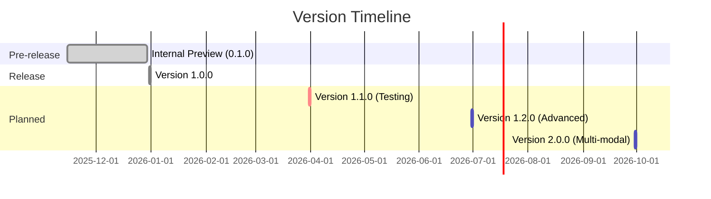

# Changelog

All notable changes to the AI Grounding project will be documented in this file.

The format is based on [Keep a Changelog](https://keepachangelog.com/en/1.0.0/),
and this project adheres to [Semantic Versioning](https://semver.org/spec/v2.0.0.html).

## [Unreleased]

### Planned
- Automated test suite with pytest
- Configuration management system
- Async UserClient refactor
- Enhanced error handling and retries

---

## [1.0.0] - 2025-12-31

### Added

#### Core Features
- **Task 1: No Grounding Implementation** ([task/t1/no_grounding.py](../task/t1/no_grounding.py))
  - Baseline approach loading all users into context
  - Batch processing (100 users per batch)
  - Parallel LLM calls with `asyncio.gather()`
  - Token tracking utility
  - Result filtering and aggregation

- **Task 2.1: Vector-based Input Grounding** ([task/t2/Input_vector_based.py](../task/t2/Input_vector_based.py))
  - FAISS vectorstore integration
  - Semantic similarity search
  - Batch embedding creation
  - Relevance score filtering (threshold: 0.1)
  - Context manager for lifecycle management

- **Task 2.2: API-based Input Grounding** ([task/t2/input_api_based.py](../task/t2/input_api_based.py))
  - Query parameter extraction using Pydantic
  - Structured LLM output parsing
  - User Service API search integration
  - Field-based exact matching (name, surname, email, gender)

- **Task 3: Input-Output Grounding** ([task/t3/in_out_grounding.py](../task/t3/in_out_grounding.py))
  - Chroma vectorstore with persistence
  - Differential vectorstore updates
  - Named Entity Extraction (hobby → user_id mappings)
  - Output grounding with real-time user fetching
  - Compact document strategy (user_id + about only)

#### Infrastructure
- **User Service** ([docker-compose.yml](../docker-compose.yml))
  - Dockerized mock API service
  - 1000 users generated on startup
  - REST API with Swagger documentation
  - Health check endpoint

- **UserClient** ([task/user_client.py](../task/user_client.py))
  - Python wrapper for User Service API
  - Methods: `get_all_users()`, `get_user(id)`, `search_users()`, `health()`
  - Exception handling for HTTP errors

#### Documentation
- **Comprehensive Documentation Suite** ([docs/](../docs/))
  - [README.md](./README.md): Project overview and quickstart
  - [architecture.md](./architecture.md): System design with Mermaid diagrams
  - [api.md](./api.md): API reference and examples
  - [setup.md](./setup.md): Environment setup guide
  - [testing.md](./testing.md): Testing strategy and validation
  - [glossary.md](./glossary.md): Domain terminology
  - [roadmap.md](./roadmap.md): Future plans and milestones
  - [changelog.md](./changelog.md): Version history (this file)

- **Architecture Decision Records** (ADR structure created)
  - [docs/adr/](../docs/adr/) directory for future ADRs

- **Copilot Instructions** ([.github/copilot-instructions.md](../.github/copilot-instructions.md))
  - Project patterns and conventions
  - Developer workflows
  - Integration points

#### Configuration
- **Dependencies** ([requirements.txt](../requirements.txt))
  - LangChain Community 0.3.31
  - LangChain OpenAI 1.0.2
  - LangChain Chroma 1.0.0
  - FAISS CPU 1.12.0
  - Requests 2.28.0+

- **Environment Configuration** ([task/_constants.py](../task/_constants.py))
  - DIAL API endpoint configuration
  - User Service endpoint
  - Environment variable support for API keys

### Technical Highlights

#### Performance Optimizations
- Parallel batch processing for embeddings and LLM calls
- Async/await patterns throughout
- Efficient vectorstore merging (FAISS)
- Incremental updates for Chroma vectorstore

#### Design Patterns
- Context managers for resource lifecycle
- Pydantic models for type safety and validation
- Async context managers (`__aenter__`, `__aexit__`)
- Token tracking for cost awareness

#### Educational Value
- Three progressively sophisticated grounding strategies
- Clear trade-offs demonstrated (cost, accuracy, latency)
- Extensive inline documentation and comments
- Step-by-step implementation guidance

### Developer Experience
- Virtual environment setup ([dial_grounding/](../dial_grounding/))
- Docker Compose for easy service startup
- Swagger UI for API exploration
- Modular task structure for independent exploration

---

## [0.1.0] - 2025-11-15 (Internal Preview)

### Added
- Initial project structure
- Basic User Service integration
- Prototype of no grounding approach
- Docker setup for user service

### Changed
- Refined project scope to focus on three approaches
- Updated documentation structure

---

## Version Comparison



---

## Statistics

### Version 1.0.0 Metrics

| Metric | Count | Notes |
|--------|-------|-------|
| **Lines of Code** | ~1,500 | Python code only |
| **Documentation Pages** | 9 | Comprehensive guides |
| **Mermaid Diagrams** | 12 | Architecture visualizations |
| **API Endpoints** | 4 | User Service REST API |
| **Grounding Strategies** | 3 | Plus 1 baseline |
| **Python Files** | 8 | Core implementation |
| **Dependencies** | 5 | Core packages |

### Token Usage Benchmarks (Sample Queries)

| Approach | Avg Tokens | Min | Max |
|----------|-----------|-----|-----|
| No Grounding | 35,000 | 20,000 | 50,000 |
| Vector-based | 3,500 | 2,000 | 5,000 |
| API-based | 2,000 | 1,000 | 3,000 |
| Input-Output | 5,500 | 3,000 | 8,000 |

*Based on test queries against 1000-user dataset*

---

## Migration Guides

### Upgrading to 1.0.0 (from 0.1.0)

#### Breaking Changes
None (first stable release)

#### New Requirements
- Python 3.11+ (was 3.9+)
- Docker Compose 2.0+ (was 1.x)
- DIAL API key now required

#### Setup Changes
```bash
# Old
pip install -r requirements.txt

# New (recommended)
python -m venv dial_grounding
source dial_grounding/bin/activate
pip install -r requirements.txt
```

#### Configuration Changes
```python
# Old (0.1.0)
API_KEY = "hardcoded-key"

# New (1.0.0)
API_KEY = os.getenv('DIAL_API_KEY', '')
```

---

## Contributors

### Version 1.0.0
- Project architecture and implementation
- Comprehensive documentation suite
- Testing and validation

*Want to contribute? See [Roadmap](./roadmap.md) for planned features.*

---

## Release Notes Format

Each release follows this structure:

### [Version] - Date

#### Added
New features and capabilities

#### Changed
Modifications to existing features

#### Deprecated
Features marked for removal

#### Removed
Deleted features or files

#### Fixed
Bug fixes and corrections

#### Security
Security-related updates

---

## Related Documentation

- [Roadmap](./roadmap.md) - Future plans and upcoming releases
- [Architecture](./architecture.md) - System design evolution
- [Setup Guide](./setup.md) - Installation for different versions

---

## Changelog Maintenance

### How to Update

1. **During Development**: Add entries to `[Unreleased]` section
2. **Before Release**: 
   - Move `[Unreleased]` items to new version section
   - Update version number and date
   - Add release links at bottom
3. **After Release**: 
   - Tag repository with version (`git tag v1.0.0`)
   - Update [Roadmap](./roadmap.md) to reflect completion

### Entry Guidelines

- Use present tense ("Add feature" not "Added feature")
- Be specific about what changed
- Link to relevant files or PRs
- Group related changes together
- Highlight breaking changes clearly

---

## Version Links

[Unreleased]: https://github.com/your-org/ai-grounding/compare/v1.0.0...HEAD
[1.0.0]: https://github.com/your-org/ai-grounding/releases/tag/v1.0.0
[0.1.0]: https://github.com/your-org/ai-grounding/releases/tag/v0.1.0

---

**Note**: This project is under active development. Check [Roadmap](./roadmap.md) for upcoming features and releases.
