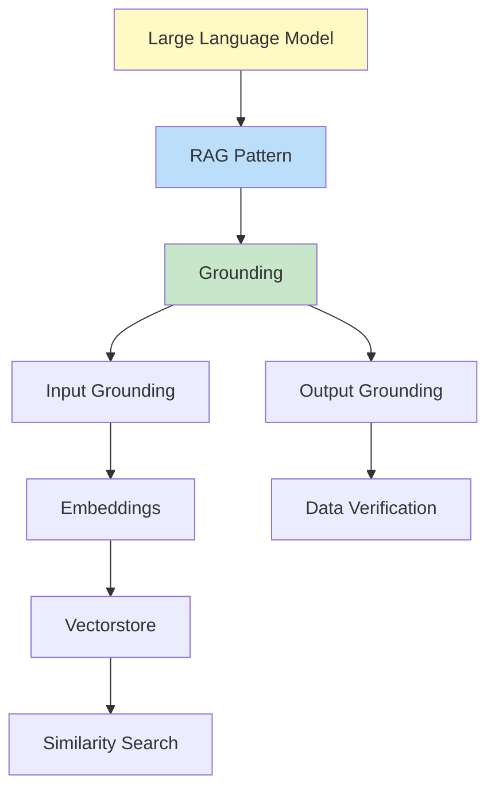

# Glossary

## A

### Augmented Prompt
A prompt that combines the original user query with retrieved context from external sources. Example: original query + relevant user data from vectorstore.

### Azure OpenAI
Microsoft Azure's hosted service providing access to OpenAI models (GPT-4, embeddings, etc.) with enterprise features and compliance.

### Async/Await
Python asynchronous programming pattern enabling concurrent I/O operations without blocking. Used extensively in this project for parallel API calls and batch processing.

## B

### Batch Processing
Strategy of splitting large datasets into smaller chunks (batches) for parallel or sequential processing. Default batch size in this project: 100 users.

### Batching (Embeddings)
Creating vector embeddings for multiple documents simultaneously to reduce API overhead and improve throughput.

## C

### Chroma (ChromaDB)
Open-source vector database with built-in persistence, used in Task 3 for storing and searching user embeddings with automatic updates.

### Cold Start
Initial system execution requiring full data loading and vectorstore creation. Subsequent runs are "warm starts" with existing data.

### Context Window
Maximum number of tokens an LLM can process in a single request. GPT-4 typically supports 8k-128k tokens depending on model variant.

## D

### DIAL (Distributed AI Lab)
EPAM's internal proxy service for accessing Azure OpenAI APIs with authentication, rate limiting, and cost tracking.

### Differential Update
Strategy of synchronizing vectorstores by computing differences (additions/deletions) rather than full rebuilds. Used in Task 3.

### Document (LangChain)
Data structure containing `page_content` (text) and optional `metadata` (dict). Used as input for vectorstore embeddings.

## E

### Embedding
Numerical vector representation of text capturing semantic meaning. Enables similarity search by comparing vector distances.

### Embedding Model
Neural network that converts text to embeddings. This project uses `text-embedding-3-small-1` (384 dimensions).

## F

### FAISS (Facebook AI Similarity Search)
High-performance vector similarity search library optimized for dense vectors. Used in Task 2.1 for in-memory indexing.

## G

### Generation (LLM)
Process of producing text output from an LLM given input prompts and context.

### GPT-4
OpenAI's fourth-generation large language model with advanced reasoning and understanding capabilities. Used via Azure in this project.

### Grounding
Connecting LLM outputs to verified external data sources to reduce hallucinations and ensure accuracy.

**Types**:
- **No Grounding**: Direct LLM processing without external data filtering
- **Input Grounding**: Filter relevant data before LLM processing
- **Output Grounding**: Verify LLM outputs against source data

## H

### Hallucination
LLM generating plausible but factually incorrect or fabricated information. Grounding strategies mitigate this risk.

## I

### Input Grounding
Strategy of filtering and retrieving relevant external data before LLM processing. Examples: vector search, API parameter extraction.

### Input-Output Grounding
Advanced strategy combining input filtering (vector search) with output verification (fetching real data by extracted IDs).

## K

### k (Top-k)
Number of most similar results to return from vector similarity search. Default in this project: k=10 (Task 2) or k=50 (Task 3).

## L

### LangChain
Python framework for building LLM applications with components for prompts, chains, agents, memory, and vectorstores.

### Latency
Time delay from request initiation to response completion. Critical metric for user experience and system performance.

### LLM (Large Language Model)
Neural network trained on massive text corpora to understand and generate human-like text. Examples: GPT-4, Claude, Llama.

## M

### Metadata
Structured information attached to documents or embeddings. Example: `{"user_id": 123}` stored alongside user embedding.

### Mock Service
Simulated API service for testing and development. This project uses `mockuserservice` Docker container.

## N

### Named Entity Extraction (NEE)
NLP technique for identifying and extracting structured information (entities) from text. Task 3 uses this to extract hobby→user_id mappings.

## O

### Output Grounding
Verification step where LLM-generated outputs (e.g., user IDs) are validated against source data to prevent hallucinations.

## P

### Persistence
Storing data (vectorstores, indices) to disk for reuse across sessions. Chroma provides built-in persistence; FAISS is in-memory only.

### PII (Personally Identifiable Information)
Data that can identify specific individuals (names, emails, IDs). Task 3 minimizes PII exposure by embedding only `user_id` + `about`.

### Prompt Engineering
Art and science of designing effective prompts to guide LLM behavior and output format.

### Pydantic
Python library for data validation using type annotations. Used for structured LLM output parsing (`SearchRequest`, `ExtractionModel`).

## R

### RAG (Retrieval Augmented Generation)
Pattern combining information retrieval (search) with LLM generation to ground responses in external knowledge.

### Relevance Score
Numerical measure (0-1) of similarity between query and retrieved documents. Threshold: 0.1 in this project.

## S

### Semantic Search
Search based on meaning rather than exact keywords. Enabled by comparing embedding vectors.

### Similarity Search
Finding items most similar to a query by measuring vector distances (cosine similarity, L2 distance).

### System Prompt
Instructions provided to LLM defining its role, behavior, and output format. Remains constant across user queries.

## T

### Token
Smallest unit of text processed by LLMs. Roughly 0.75 words in English. Critical for cost calculation.

### Token Tracker
Utility for monitoring and recording LLM token usage across API calls. Implemented in Task 1.

### Top-k
See [k (Top-k)](#k-top-k).

## U

### User Prompt
Dynamic input combining user query with retrieved context. Varies per request.

### User Service
Dockerized REST API providing mock user data for testing and demonstration. Runs on `localhost:8041`.

## V

### Vector
Numerical array representing text semantics. Example: 384-dimensional float array for "hiking enthusiast".

### Vectorstore
Database optimized for storing and searching vector embeddings. Examples: FAISS (in-memory), Chroma (persistent).

### VPN (Virtual Private Network)
Encrypted network connection required for accessing EPAM's DIAL API endpoint.

## W

### Warm Start
System execution using existing loaded data or vectorstores, avoiding cold start overhead.

---

## Abbreviations

| Abbreviation | Full Term | Context |
|--------------|-----------|---------|
| ADR | Architecture Decision Record | Design documentation |
| API | Application Programming Interface | REST endpoints |
| CPU | Central Processing Unit | FAISS CPU vs GPU variant |
| ER | Entity-Relationship | Diagram type |
| GPU | Graphics Processing Unit | Hardware acceleration for embeddings |
| HTTP | Hypertext Transfer Protocol | Network communication |
| ID | Identifier | User unique identifier |
| JSON | JavaScript Object Notation | Data format |
| LLM | Large Language Model | AI model |
| NEE | Named Entity Extraction | NLP technique |
| NLP | Natural Language Processing | Field of AI |
| PII | Personally Identifiable Information | Privacy concern |
| RAG | Retrieval Augmented Generation | Architecture pattern |
| REST | Representational State Transfer | API design |
| UI | User Interface | Swagger/web interface |
| VPN | Virtual Private Network | Network security |
| WSL | Windows Subsystem for Linux | Windows dev environment |

---

## Concept Relationships



---

## Usage Examples

### Grounding Types

```python
# No Grounding
users = get_all_users()
context = join_context(users)
answer = llm.generate(context + query)  # All data in context

# Input Grounding (Vector)
relevant_users = vectorstore.similarity_search(query, k=10)
context = format(relevant_users)
answer = llm.generate(context + query)  # Filtered data

# Input-Output Grounding
candidates = vectorstore.similarity_search(query, k=50)
extracted_ids = llm.extract_entities(candidates)  # Get IDs
verified_users = [api.get_user(id) for id in extracted_ids]  # Verify
answer = format(verified_users)  # Grounded output
```

### Token Calculation

```python
# Rough estimation
text = "Hello, world!"
tokens = len(text.split()) / 0.75  # ~2 tokens

# Actual (via LLM usage_metadata)
response = llm.invoke(prompt)
tokens = response.usage_metadata['total_tokens']  # Exact count
```

---

## Related Documentation

- [Architecture](./architecture.md) - System design context for terms
- [API Reference](./api.md) - Technical API terminology
- [Setup Guide](./setup.md) - Environment-related terms

---

## Contributing to Glossary

When adding new terms:
1. **Alphabetize** within sections
2. **Provide clear definitions** avoiding circular references
3. **Include examples** where helpful
4. **Link related terms** using markdown
5. **Update abbreviations table** if applicable

---

## Feedback

Found a term that needs clarification? Missing important terminology? Please contribute by:
- Adding to this document
- Linking from code comments
- Updating related documentation
