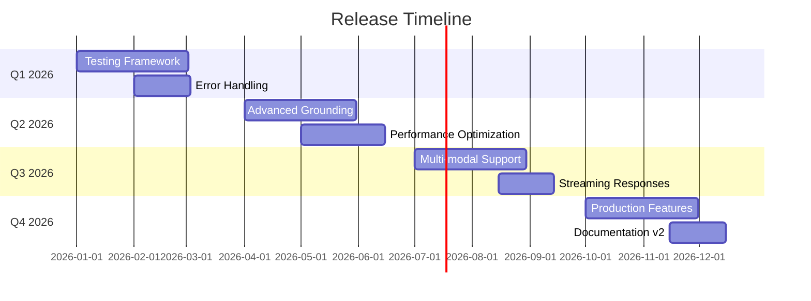

# Project Roadmap

## Table of Contents

- [Vision](#vision)
- [Current Status](#current-status)
- [Planned Releases](#planned-releases)
- [Feature Backlog](#feature-backlog)
- [Research Areas](#research-areas)
- [Risk Register](#risk-register)

## Vision

The AI Grounding project aims to be **the definitive educational resource** for understanding and implementing grounding strategies in LLM applications. Future development will focus on:

1. **Comprehensive Coverage**: Demonstrate emerging grounding patterns and techniques
2. **Production Readiness**: Evolve from educational demos to production-ready implementations
3. **Community Contribution**: Enable external contributions and extensions
4. **Performance Optimization**: Benchmark and optimize for real-world scale

---

## Current Status

### Version 1.0.0 (December 2025)

**Status**: ✅ **Released**

#### Completed Features

- ✅ Three distinct grounding strategies implemented
  - No Grounding (baseline)
  - Input Grounding (vector-based and API-based)
  - Input-Output Grounding (hybrid approach)
- ✅ FAISS and Chroma vectorstore integrations
- ✅ Docker-based User Service
- ✅ Comprehensive documentation suite
- ✅ Token tracking and cost analysis
- ✅ Async/await patterns for efficiency

#### Known Limitations

- Manual testing only (no automated test suite)
- In-memory vectorstore for Task 2 (no persistence)
- Synchronous API calls in UserClient despite async wrapper
- No pagination for large user sets
- Limited error handling and retry logic

---

## Planned Releases

---

### Release 1.1.0 (Q1 2026) - Testing & Quality

**Focus**: Improve reliability and testability

#### Planned Features

- [ ] **Automated Test Suite**
  - Unit tests with pytest
  - Integration tests for API and vectorstores
  - 80%+ code coverage target
  - CI/CD pipeline integration (GitHub Actions)

- [ ] **Enhanced Error Handling**
  - Retry logic with exponential backoff
  - Graceful degradation for service failures
  - Comprehensive exception hierarchies
  - User-friendly error messages

- [ ] **Monitoring & Observability**
  - Structured logging (loguru or structlog)
  - Metrics collection (Prometheus-compatible)
  - Performance profiling tools
  - Token usage analytics dashboard

#### Success Criteria

- [ ] All core functions have unit tests
- [ ] Integration tests pass consistently
- [ ] Error scenarios documented and tested
- [ ] CI/CD pipeline runs on every commit

---

### Release 1.2.0 (Q2 2026) - Advanced Grounding

**Focus**: Implement sophisticated grounding patterns

#### Planned Features

- [ ] **Hybrid Grounding Strategies**
  - Combine multiple retrieval methods
  - Weighted result merging
  - Confidence scoring for results
  - Fallback chains (vector → API → full scan)

- [ ] **Query Understanding**
  - Intent classification
  - Entity extraction improvements
  - Multi-turn conversation support
  - Query expansion and reformulation

- [ ] **Result Ranking**
  - Reranking with cross-encoders
  - Diversity-aware retrieval
  - Temporal relevance (recent vs historical)
  - User preference learning

- [ ] **Caching Layer**
  - Query result caching (Redis)
  - Embedding cache
  - API response caching
  - Cache invalidation strategies

#### Success Criteria

- [ ] Hybrid approach outperforms single strategies
- [ ] Query understanding accuracy > 90%
- [ ] Response time reduced by 50% with caching

---

### Release 1.3.0 (Q2 2026) - Performance & Scale

**Focus**: Optimize for production workloads

#### Planned Features

- [ ] **Scalability Improvements**
  - Pagination for large datasets
  - Streaming responses for long outputs
  - Distributed vectorstore support (Milvus, Weaviate)
  - Horizontal scaling patterns

- [ ] **GPU Acceleration**
  - FAISS GPU support
  - Batch embedding optimization
  - Model quantization for faster inference

- [ ] **Token Optimization**
  - Dynamic context pruning
  - Relevance-based filtering
  - Summarization for long documents
  - Token budget management

- [ ] **Benchmarking Suite**
  - Performance regression tests
  - Cost analysis per query type
  - Latency percentile tracking (p50, p95, p99)
  - Throughput measurements (QPS)

#### Success Criteria

- [ ] Support 10,000+ users without degradation
- [ ] Query latency < 2 seconds (p95)
- [ ] Token usage reduced by 30%
- [ ] GPU acceleration shows 5x speedup

---

### Release 2.0.0 (Q3 2026) - Multi-modal & Streaming

**Focus**: Extend beyond text-only grounding

#### Planned Features

- [ ] **Multi-modal Grounding**
  - Image embeddings (CLIP)
  - Audio/video grounding
  - Document parsing (PDFs, tables)
  - Cross-modal search (text → image)

- [ ] **Streaming Responses**
  - Token-by-token streaming
  - Progressive result refinement
  - Real-time context updates
  - WebSocket support

- [ ] **Advanced RAG Patterns**
  - Graph-based RAG
  - Recursive retrieval
  - Self-reflective RAG
  - Agentic RAG with tool use

- [ ] **User Interface**
  - Web-based demo application
  - Interactive query builder
  - Result visualization
  - Performance dashboards

#### Success Criteria

- [ ] Multi-modal search accuracy > 85%
- [ ] Streaming latency < 500ms to first token
- [ ] Web UI functional and user-tested

---

### Release 2.1.0 (Q4 2026) - Production Features

**Focus**: Enterprise-ready capabilities

#### Planned Features

- [ ] **Authentication & Authorization**
  - API key management
  - Role-based access control (RBAC)
  - Rate limiting per user
  - Audit logging

- [ ] **Deployment Options**
  - Kubernetes manifests
  - Docker Compose production profile
  - Terraform/CloudFormation templates
  - Managed service integration (AWS, Azure, GCP)

- [ ] **Data Privacy**
  - PII detection and redaction
  - Data encryption at rest
  - GDPR compliance features
  - User consent management

- [ ] **API Versioning**
  - RESTful API endpoints
  - OpenAPI 3.0 specification
  - SDK generation (Python, JavaScript)
  - GraphQL endpoint (optional)

#### Success Criteria

- [ ] Production deployment successful
- [ ] Security audit passed
- [ ] API stability guarantees
- [ ] SDKs published to package managers

---

## Feature Backlog

### High Priority

1. **Async UserClient Refactor**
   - Replace synchronous `requests` with `httpx` or `aiohttp`
   - True async I/O throughout
   - **Effort**: Small (1-2 days)
   - **Impact**: High (better performance)

2. **Configuration Management**
   - YAML/JSON config files
   - Environment-specific configs (dev, prod)
   - Hot reload support
   - **Effort**: Medium (3-5 days)
   - **Impact**: Medium

3. **Vectorstore Abstraction**
   - Common interface for FAISS and Chroma
   - Easy swapping between implementations
   - Plugin architecture for new vectorstores
   - **Effort**: Medium (5-7 days)
   - **Impact**: High

### Medium Priority

4. **Query Templates**
   - Pre-defined query patterns
   - Template variables
   - Example query library
   - **Effort**: Small (2-3 days)
   - **Impact**: Medium

5. **Batch API for User Service**
   - `/v1/users/batch` endpoint
   - Fetch multiple users by IDs in one call
   - Reduce API overhead in Task 3
   - **Effort**: Medium (3-5 days)
   - **Impact**: Medium

6. **Explainability Features**
   - Why was this result returned?
   - Relevance score explanations
   - Source attribution
   - **Effort**: Large (1-2 weeks)
   - **Impact**: High (educational value)

### Low Priority

7. **Alternative Embedding Models**
   - Support for open-source models (sentence-transformers)
   - Model comparison benchmarks
   - **Effort**: Medium (5-7 days)
   - **Impact**: Low

8. **Natural Language → SQL**
   - Convert queries to SQL for database search
   - Alternative to vector search
   - **Effort**: Large (2-3 weeks)
   - **Impact**: Medium

9. **Jupyter Notebook Examples**
   - Interactive tutorials
   - Step-by-step demonstrations
   - **Effort**: Medium (5-7 days)
   - **Impact**: Medium (educational)

---

## Research Areas

### Active Research

1. **Optimal Chunk Sizes**
   - Experiment with different document sizes for embeddings
   - Overlap strategies
   - Dynamic chunking based on content

2. **Embedding Dimensionality**
   - Trade-offs: 384d vs 1536d vs 3072d
   - Compression techniques (PCA, quantization)
   - Impact on accuracy and performance

3. **Reranking Strategies**
   - Cross-encoder rerankers
   - Multi-stage retrieval pipelines
   - Optimal k values per stage

### Future Research

4. **Adaptive Grounding**
   - Automatically select grounding strategy based on query
   - Machine learning for strategy selection
   - Cost-aware decision making

5. **Federated Grounding**
   - Ground across multiple data sources
   - Privacy-preserving aggregation
   - Distributed query execution

6. **Continuous Learning**
   - User feedback loop
   - Online learning for embeddings
   - Drift detection and retraining

---

## Risk Register

### Technical Risks

| Risk | Probability | Impact | Mitigation |
|------|-------------|--------|------------|
| **DIAL API Changes** | Medium | High | Version pinning, abstraction layer, monitoring |
| **Vectorstore Performance** | Low | High | Benchmarking, alternative backends, caching |
| **LLM Cost Overruns** | Medium | Medium | Token budgets, usage monitoring, alerts |
| **Data Privacy Violations** | Low | Critical | PII detection, audits, compliance checks |

### Operational Risks

| Risk | Probability | Impact | Mitigation |
|------|-------------|--------|------------|
| **Service Downtime** | Medium | Medium | Health checks, retries, fallback strategies |
| **Dependencies Breaking** | High | Low | Version pinning, dependency scanning |
| **Knowledge Loss** | Low | High | Documentation, code comments, training |

### Schedule Risks

| Risk | Probability | Impact | Mitigation |
|------|-------------|--------|------------|
| **Feature Creep** | High | Medium | Strict backlog prioritization, MVP focus |
| **Resource Constraints** | Medium | High | Phased releases, community contributions |
| **Technical Debt** | High | Medium | Refactoring sprints, code reviews |

---

## How to Contribute

### Request Features

1. **Open an issue** with `[Feature Request]` prefix
2. **Describe use case** and expected behavior
3. **Provide examples** if applicable
4. **Label priority** (nice-to-have vs critical)

### Contribute Code

1. **Review roadmap** to align with project direction
2. **Claim an item** from backlog or propose new
3. **Fork and branch** (`feature/your-feature-name`)
4. **Add tests** for new functionality
5. **Update documentation** accordingly
6. **Submit pull request** with clear description

### Suggest Research

1. **Share findings** via discussions or issues
2. **Propose experiments** with methodology
3. **Collaborate** on benchmarking and analysis

---

## Versioning Strategy

This project follows [Semantic Versioning](https://semver.org/):

- **MAJOR** (x.0.0): Breaking changes to APIs or architectures
- **MINOR** (1.x.0): New features, backward-compatible
- **PATCH** (1.0.x): Bug fixes, documentation updates

**Examples**:
- `1.0.0 → 1.1.0`: Add automated testing (new feature)
- `1.1.0 → 1.1.1`: Fix bug in vectorstore sync (patch)
- `1.1.1 → 2.0.0`: Redesign UserClient API (breaking change)

---

## Release Process

1. **Feature Development** → Feature branch
2. **Testing & Review** → Pull request
3. **Merge to Main** → Automated tests
4. **Version Bump** → Update version in docs and code
5. **Release Notes** → Document changes in [Changelog](./changelog.md)
6. **Tag Release** → Git tag (`v1.1.0`)
7. **Publish** → Package release (if applicable)

---

## Related Documentation

- [Changelog](./changelog.md) - Historical changes and releases
- [Architecture](./architecture.md) - Current system design
- [Testing Guide](./testing.md) - Quality assurance approach

---

## Questions or Feedback?

Have ideas for the roadmap? See a missing feature?

- **Discussions**: Propose ideas and get feedback
- **Issues**: Report bugs or request features
- **Pull Requests**: Contribute directly

---

**Last Updated**: December 31, 2025  
**Next Review**: March 31, 2026
