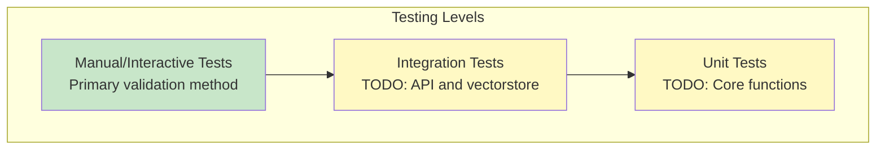

# Testing Guide

## Table of Contents

- [Overview](#overview)
- [Testing Strategy](#testing-strategy)
- [Manual Testing](#manual-testing)
- [Unit Testing](#unit-testing)
- [Integration Testing](#integration-testing)
- [Performance Testing](#performance-testing)
- [Validation Criteria](#validation-criteria)
- [Test Data](#test-data)
- [Future Testing Framework](#future-testing-framework)

## Overview

This document outlines the testing and validation approach for the AI Grounding project. As an educational demonstration project, testing focuses on:

1. **Functional correctness** of each grounding approach
2. **API integration** reliability
3. **Performance characteristics** and token usage
4. **Educational value** and clarity

### Current Testing State

> **Note**: This project currently relies on manual testing and interactive validation. Automated test suites are planned for future releases (see [Roadmap](./roadmap.md)).

---

## Testing Strategy

### Test Pyramid



### Testing Principles

1. **Validate Each Approach Independently**: Each task (t1, t2, t3) is tested separately
2. **Real API Integration**: Tests use actual User Service and DIAL APIs (no mocking for core flows)
3. **Token Tracking**: Monitor and validate LLM token usage
4. **Educational Clarity**: Test outputs should demonstrate learning concepts
5. **Reproducibility**: Same queries should produce consistent results (where deterministic)

---

## Manual Testing

### Prerequisites

Ensure setup is complete (see [Setup Guide](./setup.md)):
- ✅ User Service running (`docker-compose ps`)
- ✅ Virtual environment activated
- ✅ `DIAL_API_KEY` configured
- ✅ VPN connected

---

### Task 1: No Grounding Testing

#### Test Script: [task/t1/no_grounding.py](../task/t1/no_grounding.py)

**Run Test**:
```bash
python -m task.t1.no_grounding
```

#### Test Cases

##### TC1.1: Simple Name Search

**Input**:
```
> Do we have someone with name John that loves traveling?
```

**Expected Behavior**:
1. Fetches all 1000 users
2. Splits into 10 batches (100 each)
3. Processes batches in parallel
4. Filters "NO_MATCHES_FOUND"
5. Combines results
6. Displays final answer
7. Shows token usage summary

**Validation**:
- [ ] All batches processed (see "Processing batch..." messages)
- [ ] Token usage displayed (should be 20k-50k total)
- [ ] Results contain users named "John" interested in traveling
- [ ] No duplicate users in final output

##### TC1.2: No Matches Query

**Input**:
```
> Find users who speak Klingon
```

**Expected Output**:
```
No users found matching the query.
```

**Validation**:
- [ ] All batches return "NO_MATCHES_FOUND"
- [ ] Graceful "no results" message
- [ ] Token usage still tracked

##### TC1.3: Broad Query

**Input**:
```
> List all female users
```

**Expected Behavior**:
- Multiple batches return matches
- Combined results show female users
- High token usage (many matches)

**Validation**:
- [ ] Results contain only female users
- [ ] Multiple users returned
- [ ] Token count > 30k (large context)

#### Performance Benchmarks

| Metric | Expected Range | Notes |
|--------|---------------|-------|
| Total tokens | 20,000-50,000 | Varies by query |
| Batches processed | 10 | Fixed (1000 users / 100) |
| Latency | 10-30 seconds | Depends on LLM response time |
| API calls | 11 | 10 batches + 1 final |

---

### Task 2.1: Vector-based Testing

#### Test Script: [task/t2/Input_vector_based.py](../task/t2/Input_vector_based.py)

**Run Test**:
```bash
python -m task.t2.Input_vector_based
```

#### Test Cases

##### TC2.1.1: Cold Start Performance

**First Run**:
```
> I need user emails that filled with hiking and psychology
```

**Expected Behavior**:
1. Loads 1000 users
2. Creates embeddings (batched)
3. Builds FAISS index
4. Performs similarity search
5. Returns relevant users

**Validation**:
- [ ] Initialization time: 10-30 seconds
- [ ] Vectorstore created successfully
- [ ] Search returns users with "hiking" or "psychology" in `about`
- [ ] Relevance scores displayed (> 0.1)

##### TC2.1.2: Subsequent Queries

**Second Run** (same session):
```
> Who is John?
```

**Expected Behavior**:
- No re-initialization (vectorstore already loaded)
- Fast search (< 2 seconds)
- Returns users named "John"

**Validation**:
- [ ] No "Loading all users..." message
- [ ] Latency < 5 seconds
- [ ] Results include user(s) named "John"

##### TC2.1.3: Semantic Search Capability

**Input**:
```
> People passionate about outdoor activities
```

**Expected Behavior**:
- Matches users with "hiking", "climbing", "camping", etc.
- Semantic understanding (not keyword matching)

**Validation**:
- [ ] Results contain various outdoor-related hobbies
- [ ] Not just exact phrase "outdoor activities"
- [ ] Relevance scores > 0.1

#### Performance Benchmarks

| Metric | Expected Range | Notes |
|--------|---------------|-------|
| Cold start | 10-30 seconds | Embedding 1000 users |
| Query latency | 2-5 seconds | After initialization |
| Token usage | 2,000-5,000 | Much lower than Task 1 |
| Top-k results | Up to 10 | Configurable (k=10) |

---

### Task 2.2: API-based Testing

#### Test Script: [task/t2/input_api_based.py](../task/t2/input_api_based.py)

**Run Test**:
```bash
python -m task.t2.input_api_based
```

#### Test Cases

##### TC2.2.1: Single Field Search

**Input**:
```
> Who is John?
```

**Expected Behavior**:
1. LLM extracts `name="John"`
2. API call: `/v1/users/search?name=John`
3. Returns all users named "John"

**Validation**:
- [ ] Extracted parameters: `{name: "John"}`
- [ ] API search performed
- [ ] All results have `name == "John"`

##### TC2.2.2: Multi-Field Search

**Input**:
```
> Find users with surname Adams
```

**Expected Behavior**:
- Extracts `surname="Adams"`
- API search returns matching users

**Validation**:
- [ ] Correct field extraction (surname, not name)
- [ ] All results have `surname == "Adams"`

##### TC2.2.3: Email Search

**Input**:
```
> Look for john@example.com
```

**Expected Behavior**:
- Extracts `email="john@example.com"`
- Returns single user (or empty if doesn't exist)

**Validation**:
- [ ] Email field recognized
- [ ] Exact match performed

##### TC2.2.4: No Extractable Parameters

**Input**:
```
> I need user emails that filled with hiking and psychology
```

**Expected Behavior**:
- No specific name/surname/email mentioned
- Returns empty list or generic message

**Validation**:
- [ ] Graceful handling (no error)
- [ ] Message indicates no specific parameters found

#### Performance Benchmarks

| Metric | Expected Range | Notes |
|--------|---------------|-------|
| Parameter extraction | 1-2 seconds | LLM call |
| API search | < 1 second | Direct database query |
| Total latency | 3-6 seconds | Extraction + search + generation |
| Token usage | 1,000-3,000 | Lower than vector-based |

---

### Task 3: Input-Output Grounding Testing

#### Test Script: [task/t3/in_out_grounding.py](../task/t3/in_out_grounding.py)

**Run Test**:
```bash
python -m task.t3.in_out_grounding
```

#### Test Cases

##### TC3.1: Cold Start with Vectorstore Build

**First Run** (no existing vectorstore):
```
> I need people who love to go to mountains
```

**Expected Behavior**:
1. Detects empty/missing vectorstore
2. Fetches all users from API
3. Creates compact documents (`user_id + about`)
4. Builds and persists Chroma vectorstore
5. Performs similarity search
6. Extracts hobby→user_id mappings
7. Fetches full user records by ID
8. Returns grouped results

**Validation**:
- [ ] "Building vectorstore from User Service (cold start)" message
- [ ] Vectorstore persisted to `data/vectorstores/t3/`
- [ ] Results grouped by hobby (e.g., "hiking", "climbing")
- [ ] Full user records returned (not just IDs)

##### TC3.2: Incremental Update (Warm Start)

**Second Run** (vectorstore exists):
```
> People interested in photography
```

**Expected Behavior**:
1. Loads existing vectorstore
2. Checks for user additions/deletions
3. Updates vectorstore differentially
4. Performs search
5. Returns results

**Validation**:
- [ ] "Checking for updates..." message
- [ ] No full rebuild
- [ ] Latency < 10 seconds
- [ ] Results include photography enthusiasts

##### TC3.3: Output Grounding Verification

**Input**:
```
> Find hikers
```

**Expected Behavior**:
- LLM extracts: `{"hiking": [1, 5, 23, ...]}`
- Fetches each user by ID
- Verifies user exists (output grounding)
- Skips deleted/invalid IDs

**Validation**:
- [ ] Entity extraction produces valid JSON
- [ ] Each user ID fetched individually
- [ ] Invalid IDs handled gracefully
- [ ] Final results contain only valid users

##### TC3.4: Multi-Hobby Grouping

**Input**:
```
> People who love mountains
```

**Expected Output Structure**:
```json
{
  "hiking": [user1, user2, ...],
  "rock climbing": [user3, user4, ...],
  "mountaineering": [user5, ...]
}
```

**Validation**:
- [ ] Multiple hobby categories identified
- [ ] Users grouped correctly
- [ ] No duplicate users across groups

#### Performance Benchmarks

| Metric | Expected Range | Notes |
|--------|---------------|-------|
| Cold start | 15-40 seconds | Full vectorstore build |
| Warm start | 3-8 seconds | Differential update |
| Token usage | 3,000-8,000 | Embedding + extraction + grounding |
| Vectorstore sync | 1-3 seconds | Add/delete users |

---

## Unit Testing

### Planned Unit Tests (Future)

#### UserClient Tests

```python
# tests/test_user_client.py
import pytest
from task.user_client import UserClient

def test_get_all_users():
    client = UserClient()
    users = client.get_all_users()
    assert len(users) == 1000
    assert all('id' in u for u in users)

def test_search_users_by_name():
    client = UserClient()
    results = client.search_users(name="John")
    assert all(u['name'] == "John" for u in results)

@pytest.mark.asyncio
async def test_get_user_by_id():
    client = UserClient()
    user = await client.get_user(1)
    assert user['id'] == 1
```

#### Utility Function Tests

```python
# tests/test_no_grounding.py
from task.t1.no_grounding import join_context

def test_join_context():
    users = [
        {'id': 1, 'name': 'John'},
        {'id': 2, 'name': 'Jane'}
    ]
    result = join_context(users)
    assert 'id: 1' in result
    assert 'name: John' in result
```

---

## Integration Testing

### Planned Integration Tests (Future)

#### API Integration

```python
# tests/integration/test_user_service.py
import pytest
from task.user_client import UserClient

@pytest.fixture(scope="module")
def client():
    return UserClient()

def test_service_health(client):
    health = client.health()
    assert health['status'] == 'healthy'

def test_full_workflow(client):
    # Get all users
    users = client.get_all_users()
    assert len(users) > 0
    
    # Get specific user
    user_id = users[0]['id']
    user = await client.get_user(user_id)
    assert user['id'] == user_id
    
    # Search by name
    results = client.search_users(name=user['name'])
    assert any(u['id'] == user_id for u in results)
```

#### Vectorstore Integration

```python
# tests/integration/test_vector_search.py
from task.t2.Input_vector_based import UserRAG

@pytest.mark.asyncio
async def test_vectorstore_lifecycle(embeddings, llm_client):
    async with UserRAG(embeddings, llm_client) as rag:
        # Test search
        context = await rag.retrieve_context("hiking", k=5)
        assert len(context) > 0
        assert 'hiking' in context.lower()
```

---

## Performance Testing

### Token Usage Validation

**Script**: Create a token tracking utility

```python
# utils/token_tracker.py
class TokenAnalyzer:
    def compare_approaches(self, query: str):
        """Compare token usage across all approaches"""
        results = {
            'no_grounding': run_no_grounding(query),
            'vector_based': run_vector_based(query),
            'api_based': run_api_based(query),
            'input_output': run_input_output(query)
        }
        return results
```

**Test Queries**:
1. "Find John" (simple)
2. "People interested in hiking and photography" (medium)
3. "Give me all female users who love outdoor activities" (complex)

**Expected Token Comparison**:
```
Query: "Find John"
- No Grounding:    25,000 tokens
- Vector-based:     2,500 tokens  (90% reduction)
- API-based:        1,200 tokens  (95% reduction)
- Input-Output:     3,800 tokens  (85% reduction)
```

### Latency Benchmarking

```python
# utils/benchmark.py
import time

def benchmark_approach(func, query, runs=5):
    times = []
    for _ in range(runs):
        start = time.time()
        func(query)
        times.append(time.time() - start)
    return {
        'mean': sum(times) / len(times),
        'min': min(times),
        'max': max(times)
    }
```

---

## Validation Criteria

### Functional Correctness

- [ ] **Accurate Results**: Returned users match query criteria
- [ ] **No Hallucinations**: User data not fabricated by LLM
- [ ] **Consistency**: Same query produces consistent results
- [ ] **Completeness**: Relevant users not missed

### Performance

- [ ] **Acceptable Latency**: < 30 seconds for cold start, < 10 for warm
- [ ] **Token Efficiency**: Vector/API approaches use < 10k tokens
- [ ] **Scalability**: Handles 1000-5000 users without degradation

### Robustness

- [ ] **Error Handling**: Graceful failures for missing data
- [ ] **Service Unavailability**: Clear error messages when API down
- [ ] **Invalid Input**: Handles empty queries, special characters
- [ ] **API Rate Limits**: Respects rate limits (if implemented)

---

## Test Data

### User Service Data

**Generation**: Automatic (via `docker-compose.yml`)

**Default Size**: 1000 users

**Schema**:
```json
{
  "id": 1,
  "name": "John",
  "surname": "Doe",
  "email": "john.doe@example.com",
  "gender": "male",
  "about": "Passionate about hiking, photography, and travel."
}
```

### Custom Test Data

**Modify User Count**:
```yaml
# docker-compose.yml
environment:
  - USER_COUNT=5000
```

**Restart Service**:
```bash
docker-compose down -v
docker-compose up -d
```

---

## Future Testing Framework

### Planned Enhancements

1. **Automated Test Suite** (Q1 2026)
   - pytest-based unit tests
   - Integration tests with Docker fixtures
   - CI/CD integration

2. **Mocking Strategy** (Q2 2026)
   - Mock User Service for offline testing
   - Mock LLM responses for deterministic tests
   - pytest-mock fixtures

3. **Coverage Reporting** (Q2 2026)
   - pytest-cov integration
   - Target: > 80% code coverage
   - Automated coverage reports in CI

4. **Performance Regression Tests** (Q3 2026)
   - Track token usage over time
   - Latency benchmarks per release
   - Alert on regressions > 20%

### Contributing Tests

When contributing new features:

1. **Add manual test cases** to this document
2. **Document expected behavior** clearly
3. **Include token usage estimates**
4. **Provide validation criteria**

---

## Running All Tests

### Current Manual Test Suite

```bash
# Run all tasks sequentially
./scripts/run_all_tests.sh
```

**Script Contents** (`scripts/run_all_tests.sh`):
```bash
#!/bin/bash
set -e

echo "Testing Task 1: No Grounding"
echo "Query: Find John" | python -m task.t1.no_grounding

echo "\nTesting Task 2.1: Vector-based"
echo "Query: People who love hiking" | python -m task.t2.Input_vector_based

echo "\nTesting Task 2.2: API-based"
echo "Query: Who is John?" | python -m task.t2.input_api_based

echo "\nTesting Task 3: Input-Output Grounding"
echo "Query: Find mountain lovers" | python -m task.t3.in_out_grounding

echo "\nAll tests completed!"
```

---

## Related Documentation

- [Architecture](./architecture.md) - System design for testing context
- [Setup Guide](./setup.md) - Environment setup for testing
- [API Reference](./api.md) - API behavior and contracts

---

## Open Questions

- **Q1**: Should we implement automated regression tests?
- **Q2**: What are acceptable performance thresholds for production?
- **Q3**: How to test LLM non-determinism effectively?
- **Q4**: Should we mock DIAL API for CI/CD?
